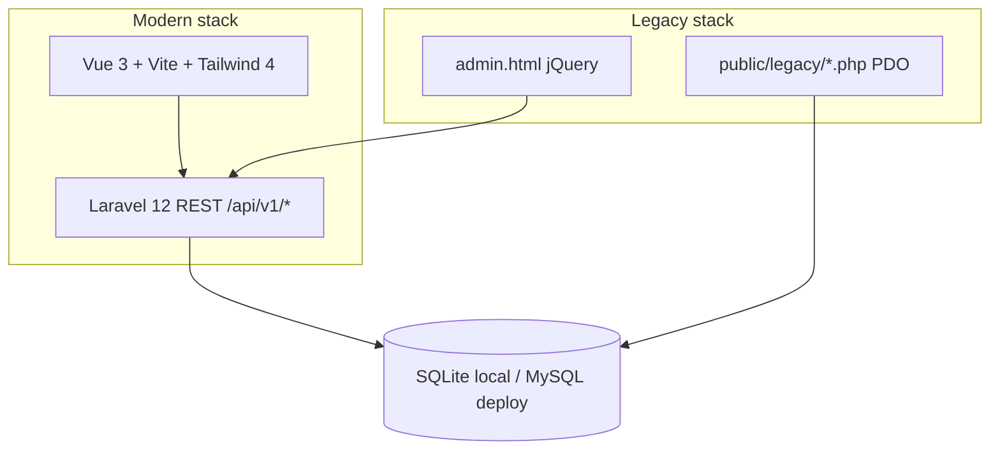

# ConnectWave — system organization

Portfolio demo: fictional Australian **hosted UC / cloud voice** operator **ConnectWave** (not a real company). Internal **operations desk** for corporate pricing/bids, provisioning, partner resellers, and business customers — support tickets (faults, provisioning, number ports), accounts, and service lines (SIP trunk, DID, hosted PBX).

See also: [README](../README.md), [PRODUCT.md](../PRODUCT.md), [REVIEWER.md](./REVIEWER.md).

## Architecture: one database, three UI layers



| Layer | Location | Role |
|--------|-----------|------|
| **SPA shell** | `resources/js/`, `resources/css/` | Main desk: tabs, lists, forms |
| **API** | `app/Http/Controllers/Api/*`, `routes/api.php` | JSON under `/api/v1/*` |
| **Web routing** | `routes/web.php` | Catch-all serves Blade `app` view (Vue on `/`, `/tickets/{id}`, etc.) |
| **Legacy** | `public/legacy/` | Vanilla PHP + jQuery; same `.env` / DB via `db.php` |

The **modern + legacy** split is intentional: Laravel + Vue for new UX; older PHP/jQuery pages for ops-style tooling on the **same tables**.

## Domain model (Eloquent)

Center entity is **Account** (`tier`: reseller vs customer).

```
Account
 ├── ServiceLine  (SIP trunk, DID, hosted PBX; NSW suburb labels from config)
 ├── Ticket       (fault / provisioning / port; status + immutable history)
 ├── Quote        (corporate bid; line items; approval-ish status)
 └── ProvisioningOrder  (often linked to an approved Quote)
```

- **Ticket** status changes use `Ticket::recordStatusChange()` inside a DB transaction with the status update → `ticket_status_histories` (UI requires a note for audit). Allowed values live on model constants (`Ticket::STATUSES`, etc.).
- **Quote** has many **QuoteItem**; **ProvisioningOrder** optionally references **quote_id**.

Migrations: `database/migrations/` (accounts → service_lines → tickets → histories → quotes → provisioning).

## API surface (`routes/api.php`)

| Endpoint group | Controller | Purpose |
|----------------|------------|---------|
| `GET dashboard` | `DashboardController` | Aggregates for home summary |
| `GET accounts`, `GET accounts/{account}` | `AccountController` | List + detail (with service lines) |
| `GET/POST/PATCH tickets` | `TicketController` | Paginated list, create, show, patch (status + note) |
| `GET quotes`, `GET quotes/{quote}` | `QuoteController` | Corporate bids |
| `GET provisioning-orders`, `GET provisioning-orders/{id}` | `ProvisioningOrderController` | Provisioning tracking |

No authentication in the demo (portfolio scope).

## Frontend organization

| File / area | Purpose |
|-------------|---------|
| `App.vue` | Shell: Support queue, Corporate bids, Provisioning tabs; filters, create form, pagination |
| `BidsPanel.vue`, `ProvisioningPanel.vue` | Corporate workflows |
| `TicketDetail.vue`, `QuoteDetail.vue` | Detail routes (new tab) |
| `api.js` | Axios → `/api/v1` |
| `labels.js` | Human labels for status/type |
| `ui.js` | Shared Tailwind class helpers |
| `demoBrand.js` | Brand copy + stack switcher links (keep in sync with `public/legacy/admin.html`) |

**Config:** `config/demo.php` is the PHP source of truth for fictional names, resellers, customers, NSW suburbs. Vue mirrors branding in `resources/js/demoBrand.js`.

## Data and demo volume

- **`UcDemoSeeder`** — bulk accounts, lines, tickets, showcase refs, history backfill; calls **`CorporateDemoSeeder`** for quotes/provisioning.
- Env tunables: `UC_DEMO_ACCOUNTS`, `UC_DEMO_TICKETS`, `UC_DEMO_QUOTES`, `UC_DEMO_PROVISIONING`.
- Local default: **SQLite**; deploy: **MySQL 8** (optional Docker Compose for parity).

## Legacy scripts (`public/legacy/`)

| File | Behavior |
|------|----------|
| `db.php` | Parses Laravel `.env`, opens PDO (sqlite/mysql) |
| `ticket_summary.php` | Ticket-oriented legacy read |
| `admin.html`, `admin.js` | jQuery admin (project `jquery` npm dep → `public/legacy/jquery.min.js`; shared `legacy-table-sort.js`) |

## Related docs

| Doc | Use |
|-----|-----|
| [README.md](../README.md) | Stack, quick start, tests |
| [PRODUCT.md](../PRODUCT.md) | Users, principles, constraints |
| **`/portfolio`** (web) | Recruiter and hiring-manager review guide on the running app |

## Design principles (encoded in the codebase)

1. **Task first** — queue and detail beat decorative chrome.
2. **Audit trail** — ticket status history with notes on detail.
3. **Honest fiction** — disclaimer, parody customer names (first letter ≠ real brand).
4. **Stack proof** — Laravel + Vue + legacy PHP on one DB.

## Repo layout

```
├── app/Models + app/Http/Controllers/Api/   # domain + API
├── config/demo.php                            # fictional world data
├── database/migrations + seeders/             # schema + volume
├── resources/js/*.vue + api.js                # Vue desk
├── routes/api.php + web.php
├── public/legacy/                             # PHP/jQuery
├── public/build/                              # Vite output
└── docs/architecture.md + PRODUCT.md + README.md
```
